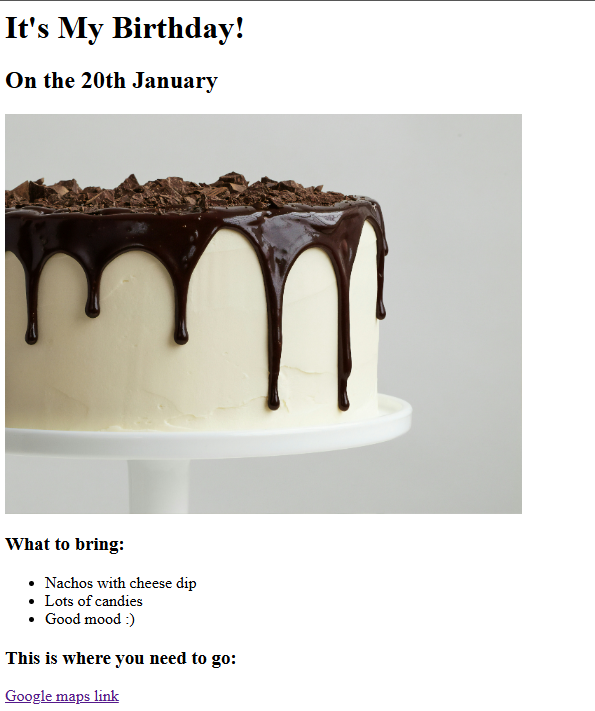
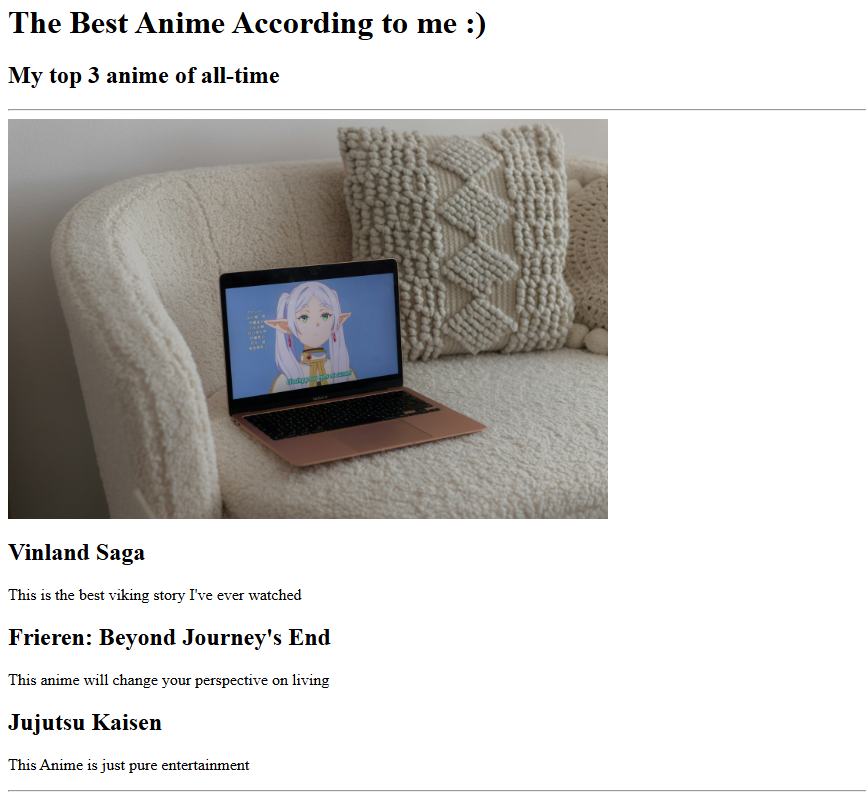

# Portfolio ReadMe

## Overview
This is a temporary HTML-only portfolio with two static projects: **Birthday Invite** and **Anime Ranking**. Both are simple HTML pages showing basic layouts without functionality.

## Projects

- **Birthday Invite Project**: A basic invitation layout with placeholders for event details.
  <br/>
  

- **Anime Ranking Project**: A static list of ranked anime titles.
  <br/>
  
## Installation

1. Clone the repository:
   ```bash
   git clone https://github.com/yourusername/temporary-portfolio.git
2. Open `index.html` in your browser to view the projects.
